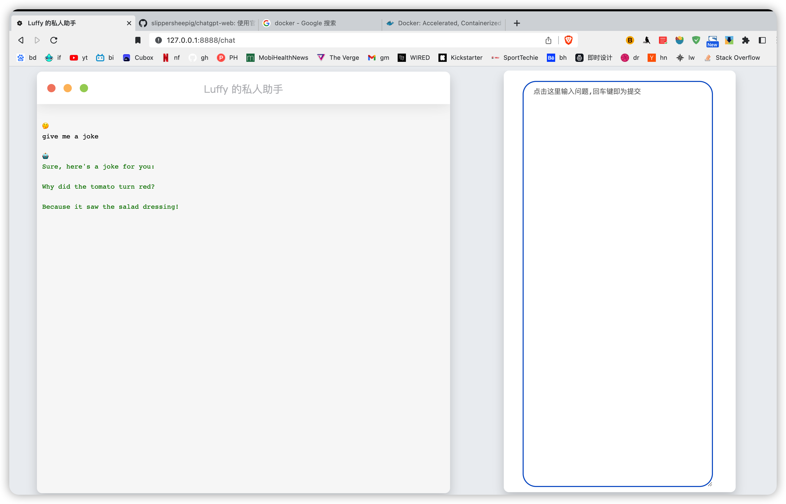

## 注意事项
- 访问地址为http://ip:port/chat
- 修改`chat.html`文件后，需要docker restart webchat才能生效
- http://127.0.0.1:8888/chat

## 前言

本项目是基于 https://github.com/slippersheepig/chatgpt-web/ 的源码基础上进行的修改，主要修改了该项目的 HTML 布局和触发方式。修改内容包括：

1. 页面布局由上下调整为左右；
2. 问题输入区域扩大，去掉了点击按钮，只保留了回车触发；
3. 区分了问题和回答的字体颜色；
4. 调整了问题和回答的行间距与段落间距；

由于作者太懒，并且好多年没碰前端代码，所以留了很多冗余代码，页面在不同尺寸屏幕呈现的兼容性也一般（可能是根本没有）。因此，本项目仅适合纯小白使用，大佬请退让。

当然，我建议小白用户通过询问 ChatGPT 来完善页面功能，优化其在不同尺寸设备上呈现的兼容性。

## 项目简介

- 名称：ChatGPT Web（直接复用的原项目）
- 功能：通过接入 openAI 的 ChatGPT API 接口，生成属于自己的问答界面
- 优点：
  - 代码本地部署，随时可以修改；
  - openAI 提供免费额度，即使将来要付费，只需要付 API 的钱，一定是最便宜的；
  - 周报生成器、小红书风格文案… 不限定风格和任务，一切都可以由自己定义；
  - 百分之百小白都可操作；
- 局限：
  - 没法喂资料给它，让它基于资料生成对应问题；比如 ChatPDF 这种功能就无法实现；
  - 作者是在 Mac 端操作的相关功能，因此是否适合 Windows 有待自己评估；

## 项目接入

### 1. 获取 openAI 的 API

1. 首先需要有一个能科学上网的工具，开全局模式，地区选择美国/韩国；推荐：
   1.  https://agentneo.tech/dashboard 
   2. ClashX（如何使用可以参加上一网址的帮助中心）；
2. 登录 openAI 官网，注册；
3. 注册需要一个国外电话，推荐在 https://sms-activate.org/ 上沟通，右侧列表有一个最新活动，选择 openAI 即可，再选择一个 openAI 支持注册的国家/地区；
   1. 虚拟电话接收短信一般需等待几分钟，看页面提示即可；
4. 点头像，找到 API，生成；

### 2.  下载/配置源码

1. 在本页面顶部，点击 `code`；
2. 选择 `Download ZIP` ；
3. 解压缩到自己常用的位置；
4. 进入文件夹里，在 `.env` 文件中输入上面获得的 API；
   1. 如果找不到该文档，打开终端/命令行（自己百度/谷歌搜下怎么打开）；
   2. 输入 cd + 空格 + 文件夹地址（自己搜索下怎么得到），然后回车；
   3. 再输入指令：open `.env`，即可看到文件打开；

### 3. 下载 Docker

1. 下载地址： https://www.docker.com/；
2. 打开 Docker；

### 4. 启动

1. 进入解压的文件夹，打开终端，依据 2 步骤，cd 到当前文件夹；
2. 输入 `docker-compose up -d` 指令；
3. 等待配置；
4. 配置成功后在任一浏览器输入地址：http://127.0.0.1:8888/chat；
   1. `127.0.0.1` 是当前的 IP 地址；
   2. 本机的 ip 地址查询请自行搜索；

### 5. 其他

1. 若需修改相关源码，请在已打开的 docker 中找到当前项目（webchat）；
2. 点击该项目，选择 Files；static 和 templates 是存在 HTML 和 CSS 以及 JS 的地方；
3. 如果想更改页面名称，点击 HTML 文件，在其中中进行修改即可；
4. 每次修改要进行保存并重启该项目（都在修改页面操作）；
5. 刷新在浏览器中打开的页面即可查看；

## 最后效果

